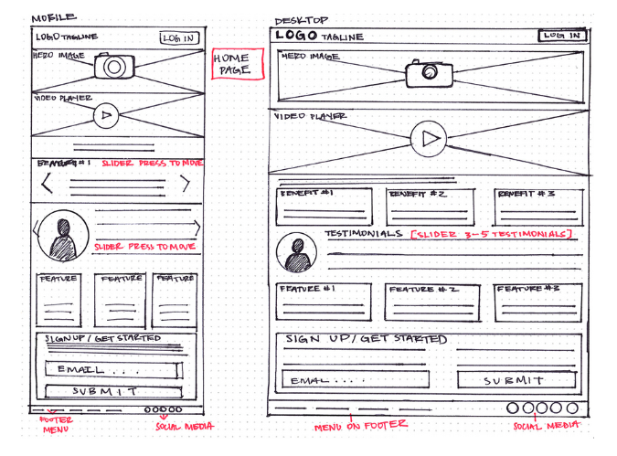

# Building Structured Webpages with HTML

## Wireframe and Design

### What is Wireframe?

Wireframing is used to plan the information hierarchy of our website, app, or product. This process focuses on how we want the user to process information on a site.

We use plain black and white diagrams.

Wireframing lets you plan the layout and interaction of your interface.



## Mozilla HTML Basics

HTML is a markup language that defines the struture and conetn of your page.  It uses elements and tags. 

```
<h1>An HTML element contains an opening tag, closing tag and content.</>
```

```
<h2>Optionally it contains an attribute.<h2>
```

## Semantics

Semantics refers to the meaning of a piece of code. 

### Benefits of Semantic Markup

1. Search engines consider its contents as important keyword.
2. Screen readers use it to help visually impaired users.
3. It makes it easier to find meaningful code blocks.
4. It suggests to the developer the type of data to be populated.
5. Semantic name goes along with element/component naming. 

