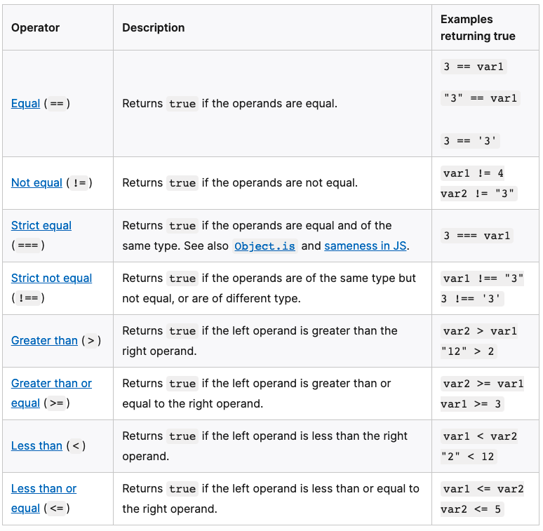
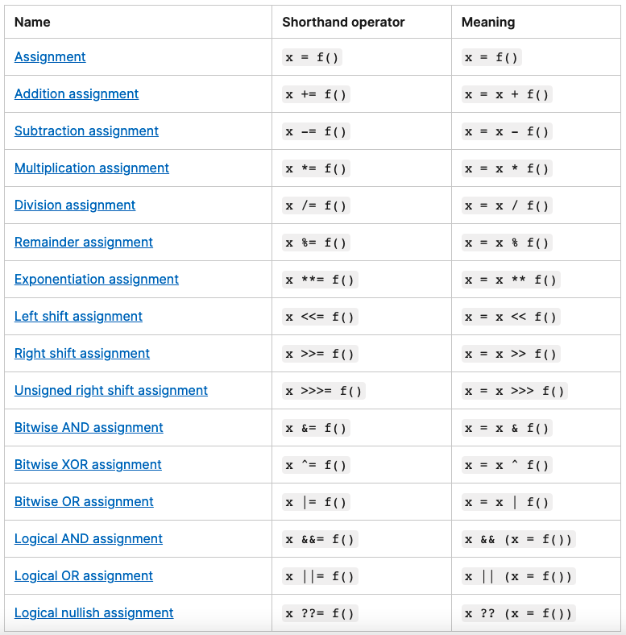

# Common Javascript Operators

[Comparison Operators](#comparison-operators)  
[Assignment Operators](#assignment-operators)  
[Looping](#looping)  

## Comparison Operators

> *Comparison operators* are used in logical statements to determine equality or difference between variables or values.

The operands can be numerical, string, logical, or object values. Strings are compared based on standard lexicographical ordering, using Unicode values. In most cases, if the two operands are not of the same type, JavaScript attempts to convert them to an appropriate type for the comparison. This behavior generally results in comparing the operands numerically. The sole exceptions to type conversion within comparisons involve the === and !== operators, which perform strict equality and inequality comparisons. These operators do not attempt to convert the operands to compatible types before checking equality. The following table describes the comparison operators in terms of this sample code:



## Assignment Operators

An assignment operator assigns a value to its left operand based on the value of its right operand. The simple assignment operator is equal (=), which assigns the value of its right operand to its left operand. That is, x = f() is an assignment expression that assigns the value of f() to x.

There are also compound assignment operators that are shorthand for the operations listed in the following table:



## Looping

Loops offer a quick and easy way to do something repeatedly. They change [Control Flow](JS-Programming.md#what-is-control-flow).

### For Statement

The ```for``` statement creates a loop that consists of three optional expressions, enclosed in parentheses and separated by semicolons, followed by a statement (usually a block statement) to be executed in the loop.

```javascript
for (let step = 0; step < 5; step++) {
  // Runs 5 times, with values of step 0 through 4.
  console.log('Walking one step');
}
```

### While Statement

A ```while``` statement executes its statements as long as a specified condition evaluates to true. A while statement looks as follows:

```javascript
let n = 0;
let x = 0;
while (n < 3) {
  n++;
  x += n;
}
```
